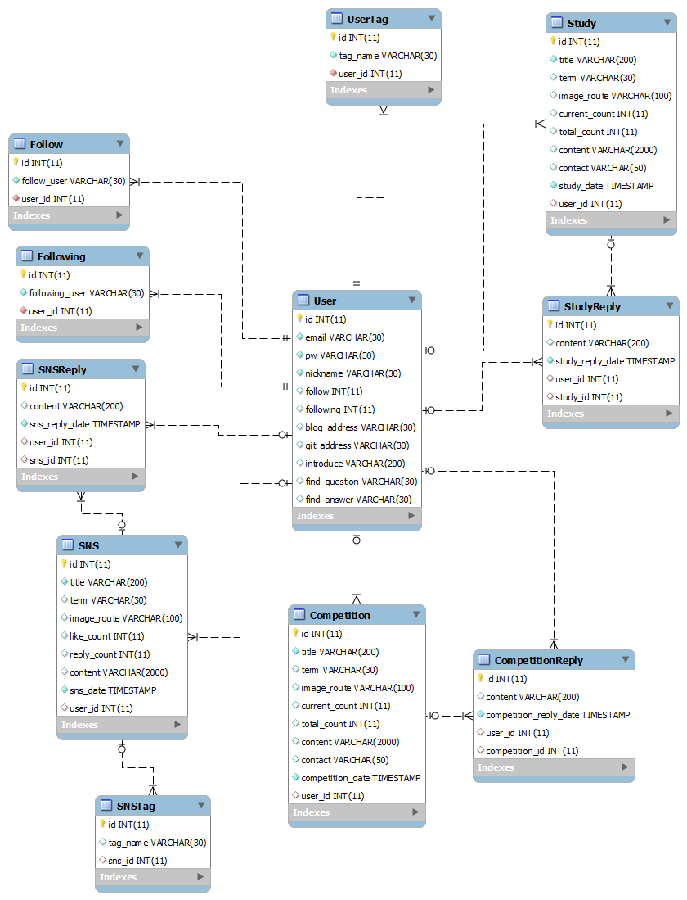

# README

## Description

해당 프로젝트는 SW 개발자들을 위한 모바일 웹 사이트를 구현합니다. 다양한 사이트에 퍼져있는 SW 공모전 정보들을 모아 사용자에게 추천합니다. 사이트를 통해 공모전과 스터디의 팀원을 구할 수 있고, 정보에서 사용자의 팔로우에 따른 뉴스피드를 볼 수 있도록 편의를 제공하고 있습니다.


## Development Tools

- Spring Framework (Back)
- Vue.js (Front)
- Java
- JPA
- sql
- JavaScript
- HTML/CSS
- Eclipse
- Mysql workbench
- VS Code
- BootStrap
- Google Chrome


## PJT construction

### Spring (Back end)

```
생략
```


### Vue.js (Front end)

```python
FRONTEND/
	public/
		favicon.ico
		index.html
	src/
		api/
			UserApi.js	# server 통신
		assets/
			css/
			images/
		components/		# component 파일 들어가는 디렉토리
			__tests__/
				test.test.js
			common/		# 공통 디렉토리
				ButtonHalf.vue
				ButtonLarge.vue
				ButtonSmall.vue
				Checkbox.vue
				Curation.vue
				Header.vue
				Input.vue
				KeywordAdd.vue
				KeywordDel.vue
				Navigation.vue
				Select.vue
				subnav.vue
				Switch.vue
				Tab.vue
				Textarea.vue
				Toast.vue
			css/
				feed/
				user/
			main/		# main(공모전, 스터디)에 들어가는 components
				competitionItem.vue
				studyItem.vue
			SNS/		# SNS에 들어가는 components
				FeedItem.vue
			user/		# 사용자 관련 components
				snsLogin/
					Google.vue
					Kakao.vue
					Select.vue
				Logo.vue
		util/
			http-common.js		# axios 요청
		views/			# 사용자에게 보여주기 위한 views
			SNS/
				IndexFeed.vue
			user/
				FindPassword1.vue
				FindPassword2.vue
				FindPassword3.vue
				Join.vue
				join1.vue
				join2.vue
				joinForm.vue
				Login.vue
				profile.vue
				testLogin.vue
			Components.vue
			Main.vue		# Main 화면
		vuex/
			actions.js
			getters.js
			mutations.js
			store.js
		App.vue
		main.js
		routes.js
	.gitignore
	babel.config.js
	eslintrc.js
	jest.config.js
	package.json
	README.md
```


## File Definition

### Back end


### Vue.js (Front end)

#### :black_medium_square: 상위 컴포넌트

| File 이름            | 기술                                                    |
| -------------------- | ------------------------------------------------------- |
| App.vue              | vue.js의 기본적인 App.vue를 정의합니다.                 |
| views/Main.vue       | 로그인 후 사용자가 보게 될 기본 Home 화면을 정의합니다. |
| views/Components.vue | 사용하기에 유용한 Components를 모아서 정의합니다.       |


#### :black_medium_square: src/components

| File 이름                 | 기술                                                         |
| ------------------------- | :----------------------------------------------------------- |
| common/파일명 생략        | 해당 디렉토리의 vue 파일들은 이후 화면 구성에서 사용하기 유용한 component를 정의합니다. |
| main/competitionItem.vue  | main 화면의 공모전 부분에 들어갈 component를 정의합니다.     |
| main/studyItem.vue        | main 화면의 스터디 부분에 들어갈 component를 정의합니다.     |
| SNS/FeedItem.vue          | SNS화면에 들어갈 component를 정의합니다.                     |
| user/snsLogin/파일명 생략 | 다른 SNS를 연동한 Login시 필요한 component를 정의합니다.     |


#### :black_medium_square: src/util

| File 이름      | 기술                                                         |
| -------------- | ------------------------------------------------------------ |
| http-common.js | 이후 다른 컴포넌트에서 baseURL과 headers 작성 없이 편하게 하기 위해 axios 요청을 정의합니다. |


#### :black_medium_square: src/views/SNS

| File 이름     | 기술                                     |
| ------------- | ---------------------------------------- |
| IndexFeed.vue | SNS 뉴스피드를 위한 페이지를 정의합니다. |


#### :black_medium_square: src/views/user

| File 이름        | 기술                                         |
| ---------------- | -------------------------------------------- |
| FindPassword.vue | 비밀번호 찾기를 위한 페이지를 정의합니다.    |
| Join.vue         | 사이트 회원 가입을 위한 페이지를 정의합니다. |
| Login.vue        | 로그인을 위한 페이지를 정의합니다.           |
| Profile.vue      | 사용자 계정에 대한 페이지를 정의합니다.      |


## wireFrame


## ERD

