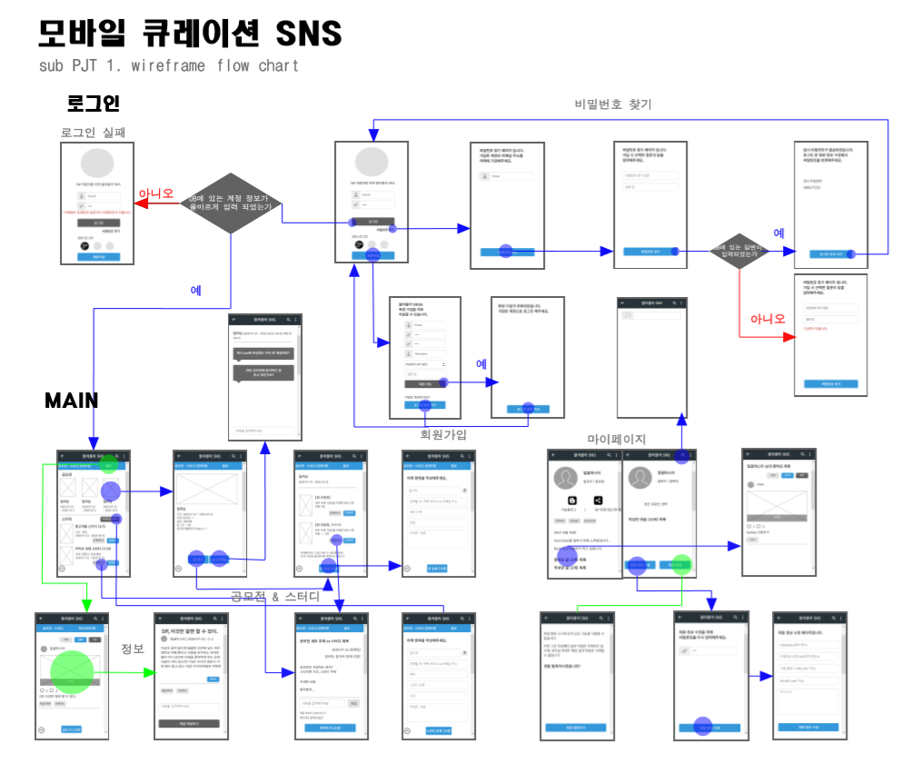

# README

## Description

해당 프로젝트는 SW 개발자들을 위한 모바일 웹 사이트를 구현합니다. 다양한 사이트에 퍼져있는 SW 공모전 정보들을 모아 사용자에게 추천합니다. 사이트를 통해 공모전과 스터디의 팀원을 구할 수 있고, 정보에서 사용자의 팔로우에 따른 뉴스피드를 볼 수 있도록 편의를 제공하고 있습니다.

## Development Tools

- Git 환경: [Gitlab](https://about.gitlab.com/)
- 이슈 관리: [Jira](https://www.atlassian.com/ko/software/jira)
- Spring Framework (Back)
- Vue.js (Front)
- Java | JPA
- sql | JavaScript | HTML/CSS
- Eclipse
- Mysql workbench
- [VS Code](https://code.visualstudio.com/)
- [BootStrap](https://bootstrap-vue.org/)
- Google Chrome
- 이 외 작업 Tools
  - Wireframe: [oven](https://ovenapp.io/) 
  - Markdown: [Typora](https://typora.io/)

## PJT Construction

> [Back end](../document/backend/Backend_Construction.md/#-directory) | [Front end](../document/frontend/Frontend_Construction.md/#-directory)

## File Definition

> [Back end](../document/backend/Backend_Construction.md/#-file-definition) | [Front end](../document/frontend/Frontend_Construction.md/#-file-definition)

## wireFrame

## ERD

