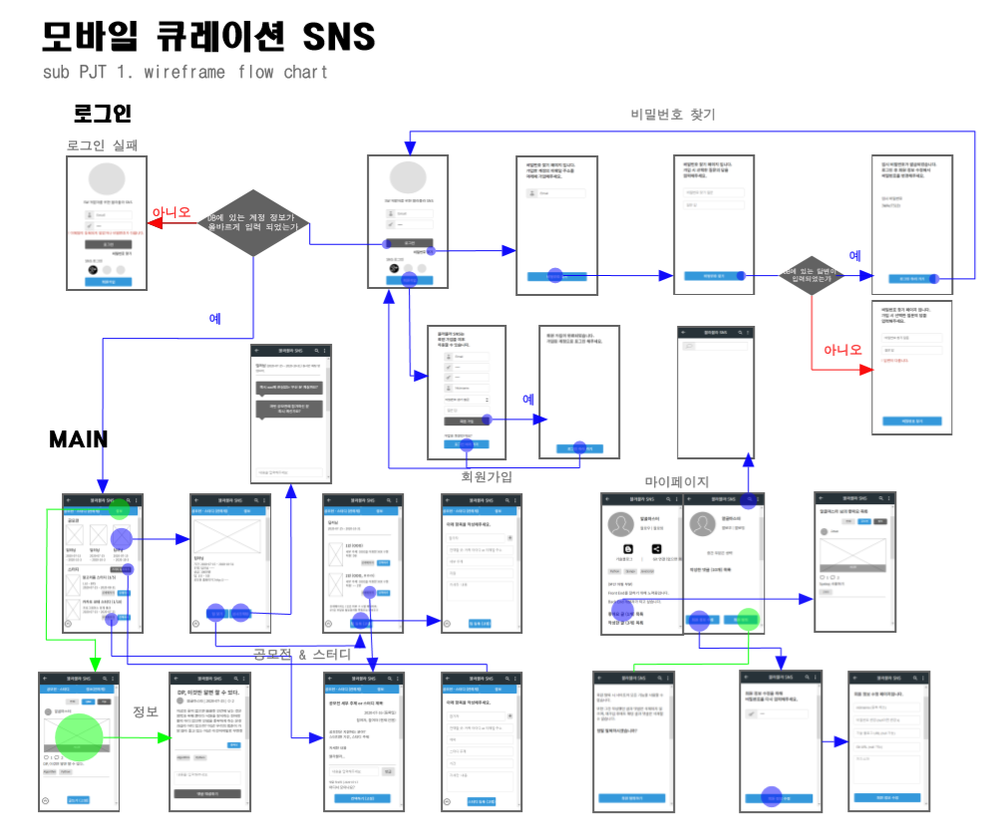
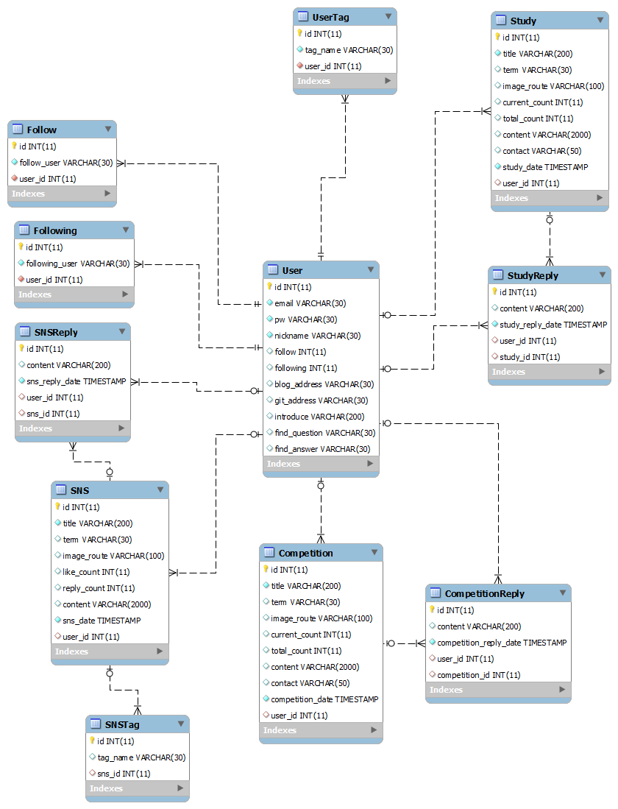
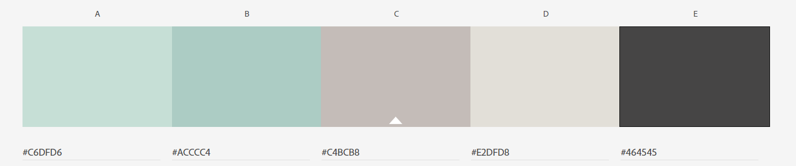

# README

## NULL 담은 공간

개발자들에게 친숙한 **NULL값**과 **너를**의 이중적인 의미를 담아서 SW 개발자를 위한 SNS, **NULL 담은 공간**으로 이름 지어졌습니다.


## Description

NULL 담은 공간은 SW 개발자들을 위한 모바일 SNS입니다. 기본적인 SNS 기능에 추가적으로 개발자들을 위한 특수한 프로젝트 팀원 매칭 기능을 도입하였습니다.  프로젝트의 기술 스택과 사용자들의 개발 능력을 이용하여 특별한 알고리즘을 통해 프로젝트에 어울리는 팀원들을 추천합니다. 개발자들이 프로젝트 팀원을 구하는 것에 더 이상 힘들지 않도록 NULL 담은 공간이 개발자들과 함께합니다.


## Development Tools

- [Git](https://about.gitlab.com/)
- [Jira](https://www.atlassian.com/ko/software/jira)
- Spring Framework
- Vue.js
- Java
- JPA
- sql
- JavaScript
- HTML/CSS
- Eclipse
- Mysql workbench
- mariaDB
- Docker
- [VS Code](https://code.visualstudio.com/)
- [BootStrap](https://bootstrap-vue.org/)
- Google Chrome
- 이 외 작업 Tools
  - Wireframe: [oven](https://ovenapp.io/) 
  - Markdown: [Typora](https://typora.io/)


## PJT Construction

> 해당 프로젝트는 **Spring**과 **Vue.js**를 사용합니다. [directory](#-File-Directory)
>
> 각 구조 확인: [Back end](./document/backend/Backend_Construction.md/#Directory) | [Front end](./document/frontend/Frontend_Construction.md/#Directory)

### 전체 구조

```python
PJT/
	Chat_Backend/
	DB/
	document/
	SNS_Backend/
	frontend/
	README.md
    docker-compose
    오늘한일_backEnd
    오늘한일_frontEnd
```


## 의존성

- 해당 프로젝트는 **Backend**와 **Frontend**로 분리되어 있습니다.
- **Backend**는 `Spring framework`를 사용해 `Java`로 작성되었습니다.
- **Frontend**는 `vue.js`를 사용해 `javascript`와 `html/css`로 작성되었습니다.


## File Definition

> **SNS_Backend**와 **frontend** 디렉토리 아래의 파일들은 아래 링크를 통해 확인할 수 있습니다.
>
> 링크: [Back end](./document/backend/Backend_Construction.md/#file-definition) | [Front end](./document/frontend/Frontend_Construction.md/#file-definition)

### :black_medium_square: document

| 디렉토리 이름 | 기술                                               |
| ------------- | -------------------------------------------------- |
| backend/      | backend 관련 md 파일들을 정의합니다.               |
| frontend/     | frontend 관련 md 파일들을 정의합니다.              |
| DB/           | Database 관련 파일들이 저장됩니다.                 |
| document/     | README를 비롯한 프로젝트 관련 파일들이 저장됩니다. |
| Chat_Backend/ | 실시간채팅 관련 파일들이 저장됩니다.               |


## [사용자 매뉴얼](./document/사용자매뉴얼.pdf)

> NULL 담은 공간에서는 서비스를 원활히 사용할 수 있도록 사용자 매뉴얼을 제공합니다.
>
> 상단의 **사용자 매뉴얼**을 클릭하면 매뉴얼(PDF) 파일로 연결됩니다.
>
> 사용자 매뉴얼은 총 23페이지로 구성되어 있습니다.


## wireFrame




## ERD




## Color Map

> NULL 담은 공간은 개발자를 위한 SNS인 만큼 컴퓨터 작업이 잦은 개발자들을 위해 눈이 편한 **녹색 계열의 색을 포인트로 선정**해 화면을 구성했습니다. 




