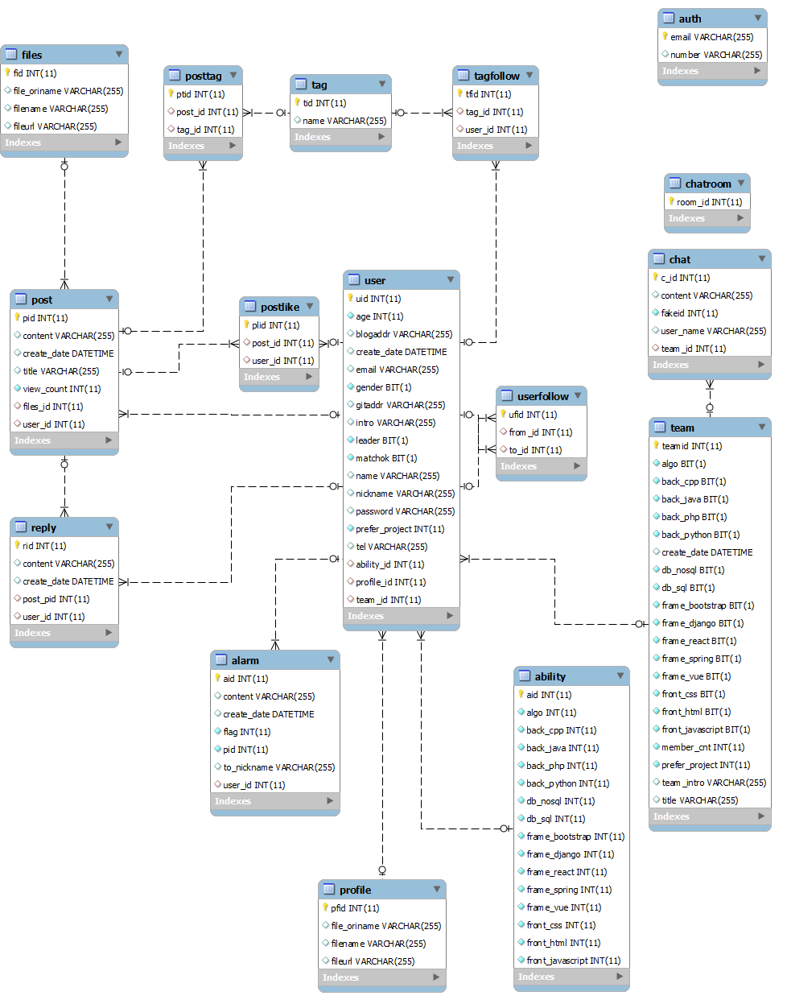

# README

## Description

해당 프로젝트는 개발자들을 위한 모바일 웹 사이트를 구현합니다. 사이트에서는 입력받은 정보를 바탕으로 스터디 팀원들을 매칭해줍니다. 스터디마다 실시간 채팅방이 만들어집니다. 사용자는 자신의 팔로우한 사람들의 게시글로 구성된 뉴스피드를 볼 수 있습니다.


## Development Tools

- [Git](https://about.gitlab.com/)
- [Jira](https://www.atlassian.com/ko/software/jira)
- Spring Framework
- Vue.js
- Java
- JPA
- sql
- JavaScript
- HTML/CSS
- Eclipse
- Mysql workbench
- [VS Code](https://code.visualstudio.com/)
- [BootStrap](https://bootstrap-vue.org/)
- Google Chrome
- 이 외 작업 Tools
  - Wireframe: [oven](https://ovenapp.io/) 
  - Markdown: [Typora](https://typora.io/)


## PJT Construction

> 해당 프로젝트는 **Spring**과 **Vue.js**를 사용합니다.
>
> 각 구조 확인: [Back end](../document/backend/Backend_Construction.md/#directory) | [Front end](../document/frontend/Frontend_Construction.md/#directory)

### 전체 구조

```python
PJT/
	Chat_Backend/
	DB/
	document/
	SNS_Backend/
	frontend/
	README.md
    docker-compose
    오늘한일_backEnd
    오늘한일_frontEnd
```


## 의존성

- 해당 프로젝트는 **Backend**와 **Frontend**로 분리되어 있습니다.
- **Backend**는 `Spring framework`를 통해 `Java`로 작성되었습니다.
- **Frontend**는 `vue.js`를 통해 `javascript`와 `html/css`를 통해 작성되었습니다.


## File Definition

> **SNS_Backend**와 **frontend** 디렉토리 아래의 파일들은 아래 링크를 통해 확인할 수 있습니다.
>
> 링크: [Back end](../document/backend/Backend_Construction.md/#file-definition) | [Front end](../document/frontend/Frontend_Construction.md/#file-definition)

### :black_medium_square: document

| 디렉토리 이름 | 기술                                               |
| ------------- | -------------------------------------------------- |
| backend/      | backend 관련 md 파일들을 정의합니다.               |
| frontend/     | frontend 관련 md 파일들을 정의합니다.              |
| DB/           | Database 관련 파일들이 저장됩니다.                 |
| document/     | README를 비롯한 프로젝트 관련 파일들이 저장됩니다. |


## wireFrame


## ERD

