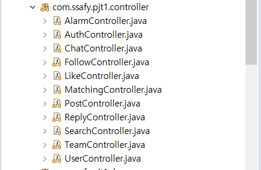
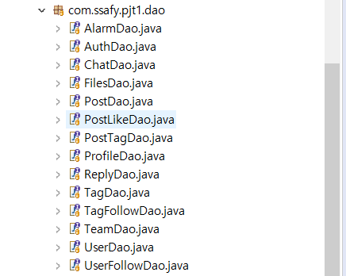
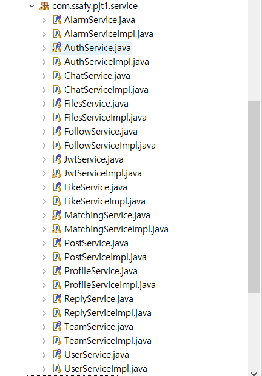
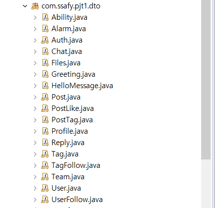

## NULL  담은 공간

## jpa

Java Persistence API. 자바의 ORM(Object-Relational Mapping) 표준 기술이다. 즉 자바의 객체와 관계형 DB를 매핑하는 기술이다.

- JPA 장점
  - CURD 메소드를 기본적으로 제공한다 & 쿼리를 안만들어도 된다.
  - 1차캐싱, 쓰기지연, 변경감지, 지연로딩을 제공한다.
  - Mybatis는 쿼리가 수정되어 데이터 정보가 바뀌면 그에 사용되고있던 DTO와 함께 수정해주어야하는데, JPA는 객체만 바꾸어주면 된다. ( 객체 중심으로 개발가능)
- JPA 단점  
  - 학습곡선이 높다.(처음에 학습하는데 오래 걸린다.)
  - 자동으로 생성되는 쿼리가 많기 때문에 성능저하의 가능성이 있다.

Hibernate ORM

Hibernate ORM은 자바 언어를 위한 객체 관계 매핑 프레임워크이다. 간단히 말해 관계형 디비 테이블을 자바 객체로 맵핑 시켜 사용하겠다는 것이다.

키워드: OneToOne, OneToMany, ManyToOne, ManyToMany.....

#### 환경설정

1. pom.xml 

   ```java
   <!-- jpa -->
   		<dependency>
   			<groupId>org.springframework.boot</groupId>
   			<artifactId>spring-boot-starter-data-jpa</artifactId>
   		</dependency>
   <!-- 하이버네이트 -->
   		<dependency>
   			<groupId>org.hibernate</groupId>
   			<artifactId>hibernate-agroal</artifactId>
   			<version>5.3.17.Final</version>
   			<type>pom</type>
   		</dependency>
   <!-- JPQL -->
   
   		<dependency>
   			<groupId>com.h2database</groupId>
   			<artifactId>h2</artifactId>
   			<version>1.4.199</version>
   		</dependency>
   ```

2. application.properties 

   ```java
   #JPA
   spring.jpa.hibernate.ddl-auto=update	
   spring.jpa.show-sql=false
   spring.jpa.properties.hibernate.use_sql_comments=true
   spring.jpa.properties.hibernate.format_sql=true
   spring.jpa.database=mysql
   spring.jpa.database-platform: org.hibernate.dialect.MySQL5InnoDBDialect
   ```


#### 폴더구조

각 기능별로 controller, DTO, Service, DAO가 필요하며 DAO는  Interface 이다.

| controller                                     | Dao                                     |
| ---------------------------------------------- | :-------------------------------------- |
|  |  |
| Service                                        | Dto                                     |
|     |  |


#### 사용법

기본적으로 MyBatis에서 모든 user 정보를 찾는 쿼리를 날리려면 xml 파일을 만들고, 직접적으로 쿼리를 날려줘야 한다.

```java
 <select id="selectAll" resultType="user">
		select * from user 
 </select>
```

하지만 JPA에서는 userdao.findAll 이라는 간단한 자바 코드로 대신 할 수 있다. DTO에서 객체와 DB 테이블을 매핑해주고, Repository를 만들고 나면 Controller나 Service에서 JPA에서 제공하는 몇 가지 기본적인 메소드들을 사용할 수 있다. 아래 세가지를 포함한 몇 가지 함수들을 제공한다. (update 메소드는 존재하지 않는다.)

```java
save(), findAll(), deleteAll(), ...
```

**※주의!** JPA에서 기본적으로 제공되는 함수 중에 findById()라는 메소드가 있는데 Id가 컬럼명이 아닌 Primary key로 찾겠다는 뜻이다. 즉, FAQ에서 no컬럼이 Primary key일 경우 findById() 로도 사용할 수 있다.


1. DTO

   ```java
   @Entity
   @Table(name = "User")
   @JsonInclude(JsonInclude.Include.NON_NULL)
   public class User {
   	@Id
   	@GeneratedValue(strategy = GenerationType.IDENTITY)
   	@JsonIgnore
   	private int uid;
   
   	private String nickname;
   	private String password;
   	private String email;
   	private String name;
   	private String tel;
   	private int age;
   	private boolean gender;
   	private String gitaddr;
   	private String blogaddr;
   	private String intro;
   	private boolean matchok;
   	private int preferProject;
   	private boolean leader;
   
   	@OneToMany(mappedBy = "from", cascade = CascadeType.ALL)
   	private Set<UserFollow> followings;
   	
   	@OneToMany(mappedBy = "to", cascade = CascadeType.ALL)	
   	private Set<UserFollow> followers;
   	
   	@OneToMany(mappedBy = "user", cascade = CascadeType.ALL)
   	private Set<TagFollow> tagfollows;
   	
   	@OneToMany(mappedBy = "user", cascade = CascadeType.ALL)
   	private Set<Post> posts = new HashSet<Post>();
   	
   	@OneToMany(mappedBy = "user", cascade = CascadeType.ALL)
   	private Set<Reply> replys = new HashSet<Reply>();
   		
   	@OneToMany(mappedBy = "user", cascade = CascadeType.ALL)	
   	private Set<PostLike> postlikes;
   	
   	@OneToMany(mappedBy = "user", cascade = CascadeType.ALL)
   	private Set<Alarm> alarms = new HashSet<Alarm>();
   		
   	@OneToOne(cascade = CascadeType.ALL)
   	@JoinColumn(name = "ABILITY_ID")
   	private Ability ability;
   		
   	@OneToOne(cascade = CascadeType.ALL)
   	@JoinColumn(name = "PROFILE_ID")
   	private Profile profile;
   	
   	//team : 유저 (1 : N 관계)
   	@ManyToOne(optional = true)
   	@JoinColumn(name = "TEAM_ID")
   	private Team team;
   
   	@CreationTimestamp
   	@Column(updatable = false)
   	private Date createDate;
   
   	public User() {
   
   	}
   
   	public User(String nickname, String password, String email, boolean lead) {
   		this.nickname = nickname;
   		this.password = password;
   		this.email = email;
   		this.leader = lead;
   	}
   	
   	public User(String nickname, String password, String email, String name, String tel, int age, boolean gender, String gitaddr, String blogaddr, String intro, Ability ability, Profile profile, boolean lead, boolean matchok, int preferProject) {
   		this.nickname = nickname;
   		this.password = password;
   		this.email = email;
   		this.name = name;
   		this.tel = tel;
   		this.age = age;
   		this.gender = gender;
   		this.gitaddr = gitaddr;
   		this.blogaddr = blogaddr;
   		this.intro = intro;
   		this.ability = ability;
   		this.profile = profile;
   		this.leader = lead;
   		this.matchok = matchok;
   		this.preferProject = preferProject;
   	}
   	
   	
   	public User(int uid, String nickname, String password, String email, String name, String tel, int age, boolean gender, boolean lead) {
   		this.uid = uid;
   		this.nickname = nickname;
   		this.password = password;
   		this.email = email;
   		this.name = name;
   		this.tel = tel;
   		this.age = age;
   		this.gender = gender;
   		this.leader = lead;
   	}
   	
   	public User(int uid, String nickname, String password, String email, String name, String tel, int age,
   			boolean gender, String gitaddr, String blogaddr, String intro, Set<UserFollow> followings,
   			Set<UserFollow> followers, Set<TagFollow> tagfollows, Set<Post> posts, Set<PostLike> postlikes,
   			Date createDate) {
   		this.uid = uid;
   		this.nickname = nickname;
   		this.password = password;
   		this.email = email;
   		this.name = name;
   		this.tel = tel;
   		this.age = age;
   		this.gender = gender;
   		this.gitaddr = gitaddr;
   		this.blogaddr = blogaddr;
   		this.intro = intro;
   		this.followings = followings;
   		this.followers = followers;
   		this.tagfollows = tagfollows;
   		this.posts = posts;
   		this.postlikes = postlikes;
   		this.createDate = createDate;
   	}
   	
   	public Set<Alarm> getAlarms() {
   		return alarms;
   	}
   
   	public void setAlarms(Set<Alarm> alarms) {
   		this.alarms = alarms;
   	}
   
   	public Set<PostLike> getPostlikes() {
   		return postlikes;
   	}
   
   	public void setPostlikes(Set<PostLike> postlikes) {
   		this.postlikes = postlikes;
   	}
   
   	public Date getCreateDate() {
   		return createDate;
   	}
   
   	public void setCreateDate(Date createDate) {
   		this.createDate = createDate;
   	}
   
   	public int getPreferProject() {
   		return preferProject;
   	}
   
   	public void setPreferProject(int preferProject) {
   		this.preferProject = preferProject;
   	}
   
   	public boolean getLeader() {
   		return leader;
   	}
   
   	public void setLeader(boolean leader) {
   		this.leader = leader;
   	}
   
   	public Team getTeam() {
   		return team;
   	}
   
   	public void setTeam(Team team) {
   		this.team = team;
   	}
   
   	public Profile getProfile() {
   		return profile;
   	}
   
   	public void setProfile(Profile profile) {
   		this.profile = profile;
   	}
   	public boolean isMatchok() {
   		return matchok;
   	}
   
   	public void setMatchok(boolean matchok) {
   		this.matchok = matchok;
   	}
   
   	public Ability getAbility() {
   		return ability;
   	}
   
   	public void setAbility(Ability ability) {
   		this.ability = ability;
   	}
   
   	public String getGitaddr() {
   		return gitaddr;
   	}
   
   	public void setGitaddr(String gitaddr) {
   		this.gitaddr = gitaddr;
   	}
   
   	public String getBlogaddr() {
   		return blogaddr;
   	}
   
   	public void setBlogaddr(String blogaddr) {
   		this.blogaddr = blogaddr;
   	}
   
   	public String getIntro() {
   		return intro;
   	}
   
   	public void setIntro(String intro) {
   		this.intro = intro;
   	}
   
   	public Set<Reply> getReplys() {
   		return replys;
   	}
   
   	public void setReplys(Set<Reply> replys) {
   		this.replys = replys;
   	}
   
   	public Set<Post> getPosts() {
   		return posts;
   	}
   
   	public void setPosts(Set<Post> posts) {
   		this.posts = posts;
   	}
   
   	public String getPassword() {
   		return password;
   	}
   
   	public void setPassword(String password) {
   		this.password = password;
   	}
   
   	public String getEmail() {
   		return email;
   	}
   
   	public int getUid() {
   
   		return uid;
   	}
   
   	public void setUid(int uid) {
   		this.uid = uid;
   	}
   
   	public String getNickname() {
   		return nickname;
   	}
   
   	public void setNickname(String nickname) {
   		this.nickname = nickname;
   	}
   
   	public void setEmail(String email) {
   		this.email = email;
   	}
   
   	public Set<UserFollow> getFollowers() {
   		return followers;
   	}
   
   	public void setFollowers(Set<UserFollow> followers) {
   		this.followers = followers;
   	}
   
   	public Set<UserFollow> getFollowings() {
   		return followings;
   	}
   
   	public void setFollowings(Set<UserFollow> followings) {
   		this.followings = followings;
   	}
   
   	public String getName() {
   		return name;
   	}
   
   	public void setName(String name) {
   		this.name = name;
   	}
   
   	public String getTel() {
   		return tel;
   	}
   
   	public void setTel(String tel) {
   		this.tel = tel;
   	}
   
   	public int getAge() {
   		return age;
   	}
   
   	public void setAge(int age) {
   		this.age = age;
   	}
   
   	public boolean isGender() {
   		return gender;
   	}
   
   	public void setGender(boolean gender) {
   		this.gender = gender;
   	}
   
   	public Set<TagFollow> getTagfollows() {
   		return tagfollows;
   	}
   
   	public void setTagfollows(Set<TagFollow> tagfollows) {
   		this.tagfollows = tagfollows;
   	}
   }
   
   ```

   ## JPQL

   **[Java Persistence Query Language]**
    JPA의 일부로 정의된 플랫폼 독립적인 객체지향 쿼리 언어이다. SQL과 비슷한 문법을 가지지만 DB 테이블에 직접 연결되는 것이 아니라 **JPA 엔티티에 대해 동작**한다. 따라서 쿼리문에 테이블이 아닌 **엔티티의 컬럼명**을 사용해주어야 한다.

   **사용법** 

   ```java
   @Query(value="delete from userfollow where from_id=:uid",nativeQuery=true)
       void deletefollow1(@Param("uid") int uid);
   ```

   ※ 주의!! Param안의 이름과 함수의 매개변수 명이 같아야 한다.

   ```java
   // 가능
   @Query(value="delete from userfollow where from_id=:uid",nativeQuery=true)
       void deletefollow1(@Param("uid") int uid);
   // 불가능
   @Query(value="delete from userfollow where from_id=:uid",nativeQuery=true)
       void deletefollow1(@Param("userid") int uid);
   ```

   

