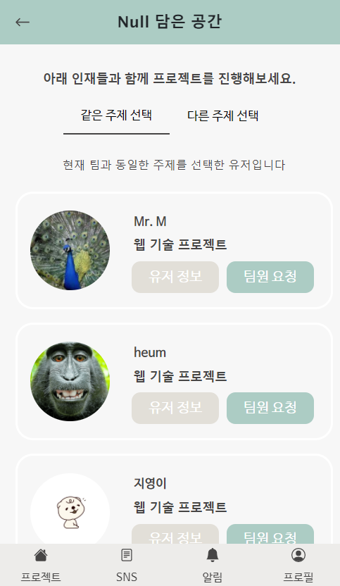
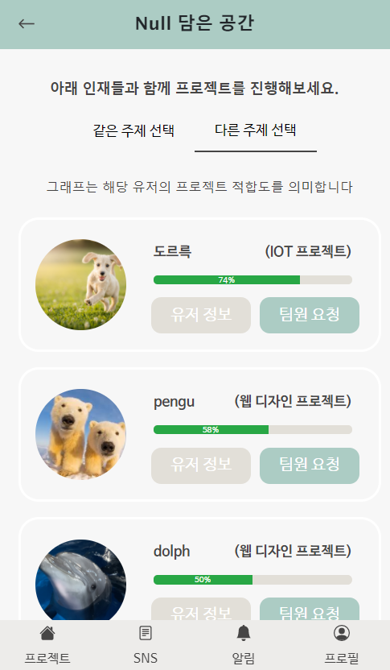

# Matching Algorithm

## Desciption

|              매칭 결과1              |              매칭결과2               |
| :----------------------------------: | :----------------------------------: |
|  |  |

Matching Algorithm은 **프로젝트 팀을 생성할 때** 팀원을 주제, 적합도에 따라서 추천해주는 기능 입니다.

## Code

`MatchingService.java`

1.  팀장이 선택한 프로젝트를 **선호하는 사람**과 **선호하지 않는 사람**으로 분류

   ex) 매칭시스템을 돌리는 팀장이 1번 프로젝트를 선호할 때,

###### 	

###### 	* 팀장과 동일한 프로젝트를 선호하는 인원들을 잘하는 사람만 매칭되지 않고 공평하게 많은 사람들이 기회를 가질 수 있도록 랜덤으로 매칭, 다른 프로젝트를 선호하는 사람은 2단계로 이어진다.

2.  각 언어들을 유저들을 **언어의 수준에 따라** 임의의 수만큼 추출

   ex) 언어 따라 상위 3명을 추출

   

3.  2단계에서 추출된 인원들중에서, 팀장이 **선호하는 기술**을 가지고 있을 때마다 그 유저에 대한 횟수 증가

   ex) 팀장이 프로젝트를 할 때 선호하는 Backend 언어가 C++과  Python일 때,

4.  3단계에서 유저가 나온 횟수가 동일 할 시에는 랜덤으로 골고루 보일 수 있도록 한 후, 최종 매칭 인원들을 적합도를 계산해서 결과 도출

   ex) 최종 매칭 인원들이 3명일 경우,

###### 	* 적합도는 각 기술마다 상 : 99%, 중 : 50%, 하 : 0%로 산정 후, 선호하는 기술에 한 해 평균을 내서 계산

