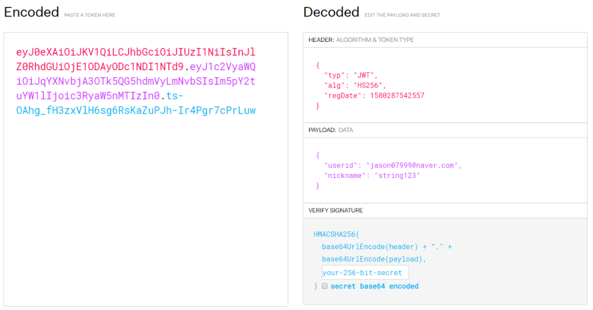

# token

### 1. 구조

- jwt 토큰은 header.payload.signature로 구성되어 있다.

  

- header에는 type이나 발행시간 등이 들어간다.

- payload에는 data가 들어간다. 본 프로젝트에서는 id, nickname을 넣음

- verify signature에는 인증을 위한 서명이 들어간다.

### 2. 토큰 create

- JwtService.Create(email, nickname)  email, nickname 파라메터로 설정.

- service -> jwt token 관련 클래스 생성.
- SALT 변수에 server에서 사용하는 키가 들어가고 create함수에서 파라메터를 받고 토큰을 리턴
- setHeaderParam에서 파라메터에 들어갈 값 (key, value)형태
- claim에는 payload부분.
- signwith에서 키생성함수를 통해 키를 만들고 서명 부분을 만들어 채움.

### 3. 토큰 인증

- JwtService.isUsable(String jwt)

- 토큰 인증을 담당하는 함수 jwt 파라메터에는 토큰값 들어감.

##### 3.1 인증 예외

- UnauthorizedException은 토큰인증에 문제가 발생했을 때 예외처리.

- isUsable은 인터셉터안에 넣어두었기에 특정 페이지에 들어가기 전에 알아서 동작.

  

- 우선 addInterceptors 안의 함수에서 addPathPatterns("/**")를 통해 모든 페이지에서 토큰 인증.

- 그리고 위쪽에 ECLUDE_PATHS 변수를 통해 제외하고 싶은 url을 입력.

### 4 . 토큰에서 데이터 가져오기

- JwtService.get(String key)

- key라는 파라메터는 nickname를 가져올지, 닉네임을 가져올지를 설정하는 부분. 