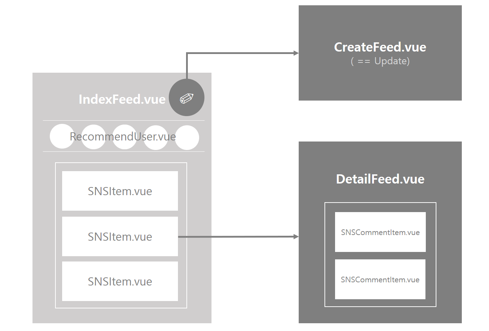

# SNS NewsFeed

## Construction



## File Definition

#### :black_medium_square: src/views/SNS

| File 이름        | 기술                                            |
| ---------------- | ----------------------------------------------- |
| `CreateFeed.vue` | 뉴스피드 게시물을 생성하는 페이지를 정의합니다. |
| `DetailFeed.vue` | 뉴스피드 게시물 상세 페이지를 정의합니다.       |
| `IndexFeed.vue`  | 뉴스피드를 위한 페이지를 정의합니다.            |

#### :black_medium_square: src/components/SNS

| File 이름            | 기술                                                       |
| -------------------- | ---------------------------------------------------------- |
| `SNSItem.vue`        | 뉴스피드에 들어갈 게시물 component를 정의합니다.           |
| `SNSCommentItem.vue` | 뉴스피드 게시물 상세페이지의  댓글 component를 정의합니다. |


## Code

#### `IndexFeed.vue`

> SNSFeed의 **최상단 컴포넌트**로 사용자의 팔로우들의 게시글을 가져와 출력한다.

- 페이지가 열릴 때(`created`) 서버에 axios 요청을 보낸다.
  - post 방식: `/post/getPost`
  - 파라미터: `storage.getItem("User")` (사용자 이메일. session storage 안에 있음)
  - response data: 게시물의 `list 객체`

  ```html
  <SNSItem v-for="article in articles" :article="article" :key="article.title" @tag-add="tagAdd"/>
  ```

- 받아온 data는 출력을 위해 `SNSItem.vue`로 내려준다.
  
- `v-for`를 사용해 하나씩 내려줌
  
- `SNSItem.vue`에서 선택된 해시태그를 받아온다.

  - 받아온 해시태그는 `clicktags`라는 data안에 저장되어 출력한다.


#### `SNSItem.vue`

> `IndexFeed.vue`로부터 받은 게시물 데이터를 출력하기 위한 컴포넌트이다.

- 해시태그의 경우, 클릭시 상단 컴포넌트로 올려서 차후 뉴스피드 게시물 필터링에 사용한다.

  - `this.$emit('tag-add', event.target.innerText)`
    - `.innerText`를 통해 클릭된 해시태그의 태그네임만 가져온다.

- 좋아요를 클릭 시 axios 요청을 보내 일부 DOM만 변경한다.

  - post 방식: `/like/post`

  - 파라미터: `formData` 형식 (사용자 이메일, 게시글 id)

    ```javascript
    let formData = new FormData();
    formData.append("email", storage.getItem("User"));
    formData.append("postid", this.article.pid);
    ```

  - response data: 게시물의 좋아요 여부와 좋아요한 사람 수

    - 받아온 데이터는 `article.likeFlag` 와 `article.likeCount` 데이터에 적용

  - 색상 변경을 위해 `computed`에서 좋아요 변경 여부 확인

    ```javascript
      computed: {
        // 좋아요 바뀌는 것 감지
        likeChange() {
          this.likeCheck();
          return this.likeColor
        },
      },
    ```

- 제목과 이미지는 클릭 시 `DetailFeed.vue`로 넘기기 위해 `router-link`를 사용한다.

  ```html
  <router-link :to="{ name: 'FeedDetail', params: { postId: article.pid }}"></router-link>
  ```

  - name과 param을 넘겨준다.

- 이미지는 backend에서 `base64`로 포맷된 형식으로 넘어온다.

  - decode해서 출력

    ```html
    
    ```

    - `article.file`은`base64`로 encode된 image file이다.


#### `DetailFeed.vue`

> `SNSItem.vue`보다 더 상세한 게시글 페이지를 위한 컴포넌트이다.

- `router-link`로 넘어올 때 받아온 postId를 `props`로 담아둔다.
- 페이지 생성 시(`created`) axios 요청을 보내 해당 페이지 데이터를 받아온다.
  - post 방식: `/post/postDetail`
  - 파라미터: `formData` 형식 (사용자 이메일, 게시글 id)

- 페이지 삭제 시에도 axios 요청을 보낸다.
  - post방식: `/post/postDelete`
  - 파라미터: `this.article.pid` (게시글 id)


#### `CreateFeed.vue`

> 게시물 생성을 위한 컴포넌트이다.

- 이미지는 파일 업로드 기능을 사용한다.
  - ` accept="image/*"`를 사용하여 image 파일만 올릴 수 있도록 제한한다.

- 작성 후 axios 요청을 보내 게시글을 생성한다.

  - post 방식: `/post/create`

  - 파라미터: `formData` 형식 (아래 참고)

    ```javascript
    let formData = new FormData();
    formData.append("files", this.file);
    formData.append("email", storage.getItem("User"));
    formData.append("title", this.article.title);
    formData.append("content", this.article.content);
    formData.append("hashtags", this.article.hashtags);
    ```

  - response를 받으면 newsfeed 페이지로 이동한다.


## Reference

- stack overflow
- [base64 encode]([https://www.it-swarm.dev/ko/javascript/%EC%9E%90%EB%B0%94-%EC%8A%A4%ED%81%AC%EB%A6%BD%ED%8A%B8%EB%A5%BC-%EC%82%AC%EC%9A%A9%ED%95%98%EC%97%AC-base64-%EB%AC%B8%EC%9E%90%EC%97%B4%EB%A1%9C-%EC%9D%B4%EB%AF%B8%EC%A7%80%EB%A5%BC-%EB%B3%80%ED%99%98%ED%95%98%EB%8A%94-%EB%B0%A9%EB%B2%95/972897309/](https://www.it-swarm.dev/ko/javascript/자바-스크립트를-사용하여-base64-문자열로-이미지를-변환하는-방법/972897309/))

