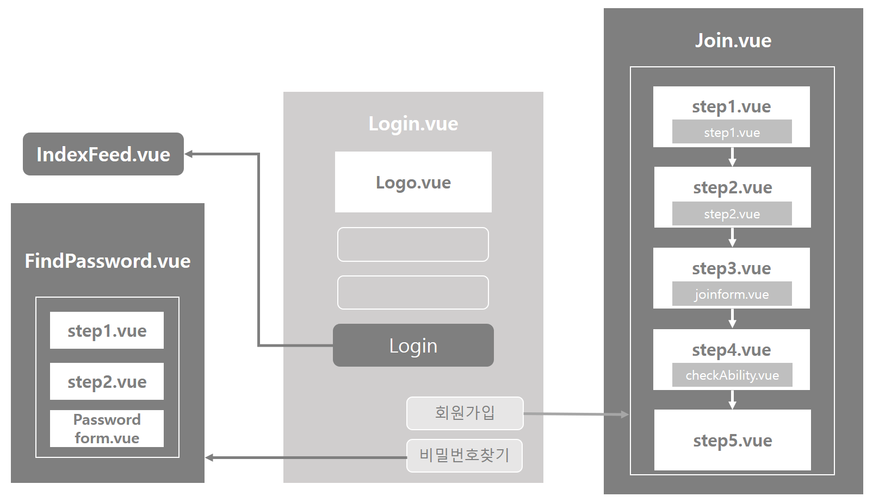

# User - Login_Join

## Construction




## File Definition

#### :black_medium_square: src/views/user

| File 이름   | 기술                                         |
| ----------- | -------------------------------------------- |
| `Login.vue` | 로그인을 위한 페이지를 정의합니다.           |
| `Join.vue`  | 사이트 회원 가입을 위한 페이지를 정의합니다. |

#### :black_medium_square: src/components/user

| File 이름      | 기술                                                         |
| -------------- | ------------------------------------------------------------ |
| `step1.vue`    | 회원가입을 위한 이메일 인증을 보내는 component를 정의합니다. |
| `step2.vue`    | 회원가입 이메일 인증 component를 정의합니다.                 |
| `joinform.vue` | 회원가입을 위한 입력 폼 component를 정의합니다.              |


## Code

#### `Login.vue`

> 해당 프로젝트의 첫 페이지이자 User Login 페이지를 출력한다.

- 로그인 정보를 받아 `storage`세팅 후 서버에 axios 요청을 보낸다.

  - post 방식: `/account/login`

  - 파라미터: `email`, `password`

  - response data를 `storage`에 집어넣는다.

    ```javascript
    storage.setItem("token", res.data.token)
    var User = {
      "email" : res.data.email,
      "nickname" : res.data.nickname,
    }
    storage.setItem("User", res.data.email)
    ```

    

#### `Join.vue`

> 회원가입을 위한 컴포넌트로 하위 컴포넌트로 3 step을 바꾸어 출력한다.

- 변수를 통해 다음 컴포넌트로 넘겨준다.

- 이메일 인증 번호를 받기(`Gostep2`) 위해 axios 요청을 보낸다. 

  - post 방식: `/auth/loginMailSend`
  - 파라미터: `this.user.email,` (사용자 이메일)

- 이메일 인증 번호 확인(`Gostep3`)을 위해 axios 요청을 보낸다.

  - post 방식: `/auth/loginMailConfirm`

  - 파라미터

    ```javascript
    {
        "auth_email": this.user.email,
        "auth_number": authNum,
    }
    ```

- 최종적으로 회원가입(`Join`)을 위해 axios 요청을 보낸다.

  - post 방식: `/account/signup`
  - 파라미터: `입력받은 데이터 전부`
  - response 후 로그인 페이지로 이동한다.

  

## Reference

- [Token 관련 게시 블로그](토큰 사용)